# 3. Document Management
## 3.1 Importing Documents
Currently, only PDF format documents are supported for import; other formats are not.

• Note: The Standard version allows uploading a maximum of 30 pages per document, with a maximum file size of 10MB and a total capacity of 20MB. The Pro version allows uploading up to 100 pages per document, with a maximum file size of 100MB and a total capacity of 30960MB.

If no specific folder is selected, documents will be uploaded to [My Documents].
There are 2 ways to import documents:

Before importing, click [My Documents] to select a specific folder, then click [Start Adding] to upload documents to that folder;
.png)
Or right-click [My Documents] and select [Add Document].
.png)
.png)
• Import Single Document: Click the [Add] button to select a single local document to import into the reader;
.png)
• Import Multiple Documents: Click the [Add] button, and while holding down the Shift key, you can select multiple local documents to import.
.png)
## 3.2 Create New Folder
Create new folders in [My Documents] to categorize and manage documents:
• Right-click [All Documents], click the [New Folder] button, enter the folder name, and click Confirm.
.png)
.png)
• Create Subfolder: In [My Documents], click to open an existing folder, then right-click [New Subfolder] (if no existing folder is selected, the new folder will be created as a top-level folder under [My Documents] by default);
.png)
• Import Documents to Folder: Right-click the target folder and click [Add Document] or right-click the document and select [Move] to the target folder. (Alternatively, you can drag and drop a document directly into a folder to add it).
.png)
.png)
## 3.3 Folder Management
Right-clicking on a folder allows for document management functions such as [New], [Rename], [Move], [Copy], [Share Folder], and [Delete].
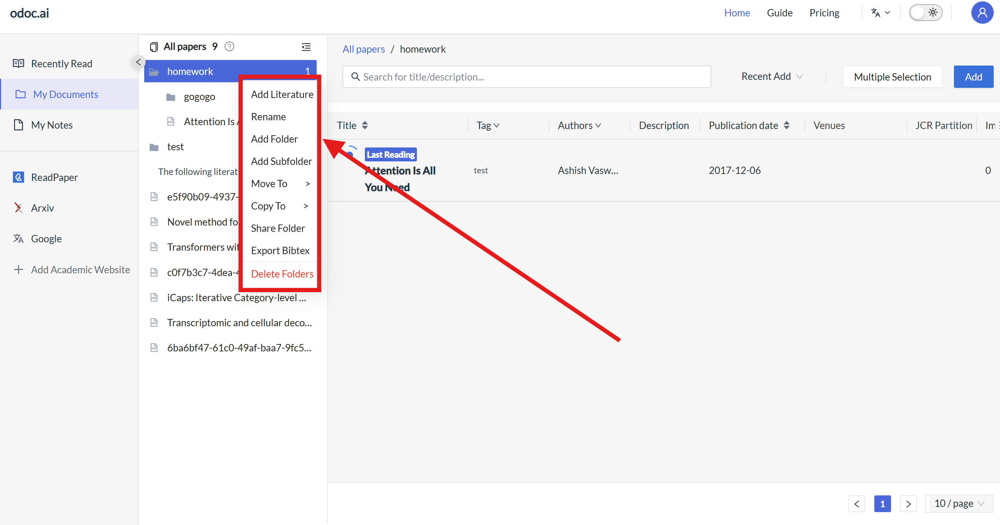
## 3.4 Viewing Document Bibliographic Information
After importing a document, its bibliographic information will be automatically displayed: [Document Title], [Tags], [Author], [Notes], [Publication Date], [Inclusion Status], [JCR Quartile], [Impact Factor], [Importance].
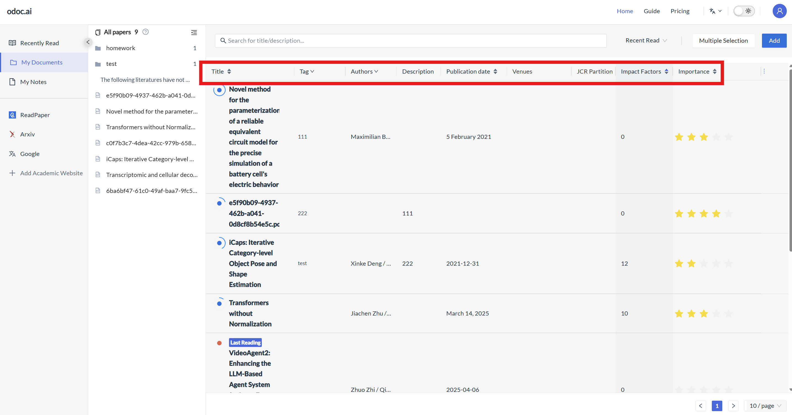
## 3.5 Filtering Bibliographic Information
Click the [Multi-select Type] button in the top right corner to choose whether to display or hide bibliographic information in the document list.
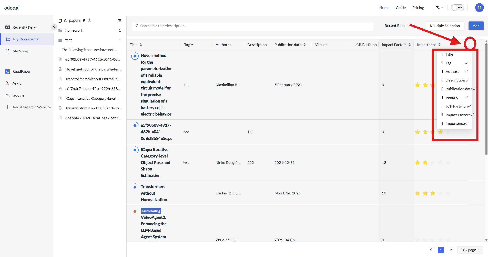
## 3.6 Modifying Bibliographic Information
Click on the document's [Tags], [Author], [Impact Factor], [JCR Quartile], [Publication Date], [Inclusion Status], [Importance] to modify the bibliographic information.
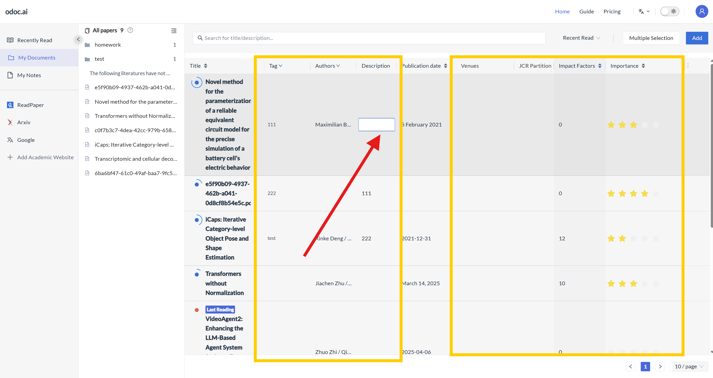
## 3.7 Document Sorting
Documents in "Uncategorized Documents" and custom folders can be sorted by clicking the sort buttons to the right of [Document Title], [Impact Factor], [Publication Date], [Importance]. This allows sorting by document title's first letter, impact factor value (high to low/low to high), publication date (ascending/descending), or document importance index (ascending/descending): The first click sorts in descending order, the second click sorts in ascending order, and the third click cancels the sorting.
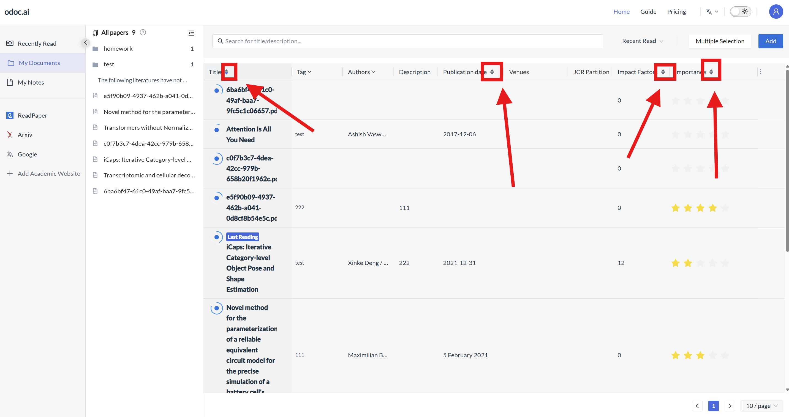
## 3.8 Document Search
You can quickly retrieve documents by entering [Title], [Tags], [Publication Date], [Notes] in the search bar above the title information. If searching by author, click [Author] to search.
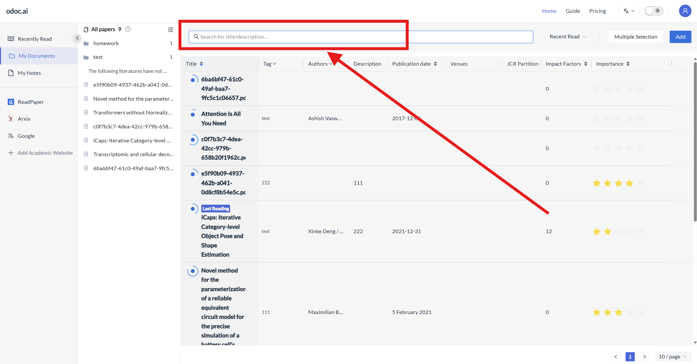
## 3.9 Tagging and Filtering
### 3.9.1 Adding Tags
Click the [Add Document] button below the document title to add system tags/existing self-created tags/create new tags to the document. Multiple tags can be added to one document. Newly created tags will be saved in self-created tags.
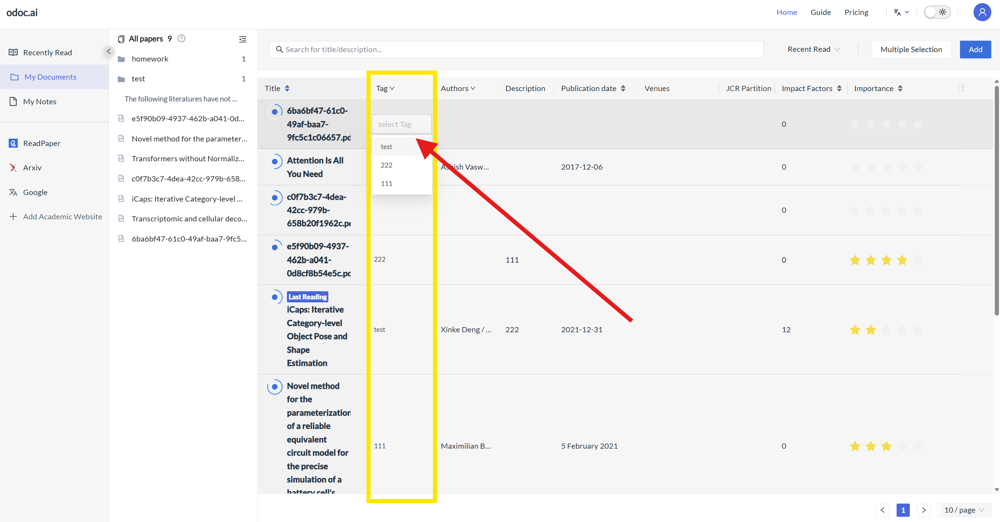
### 3.9.2 Filtering by Tags
Click the [Filter Tags] button in the top right corner to filter documents based on tags. Supports single and multiple selections.
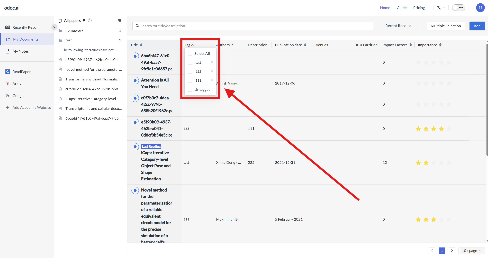
### 3.9.3 Deleting Tags
Unused document tags can be deleted from the tag section of the document management interface. However, currently, existing tags cannot be re-edited; you can delete an old tag and then add a new one.
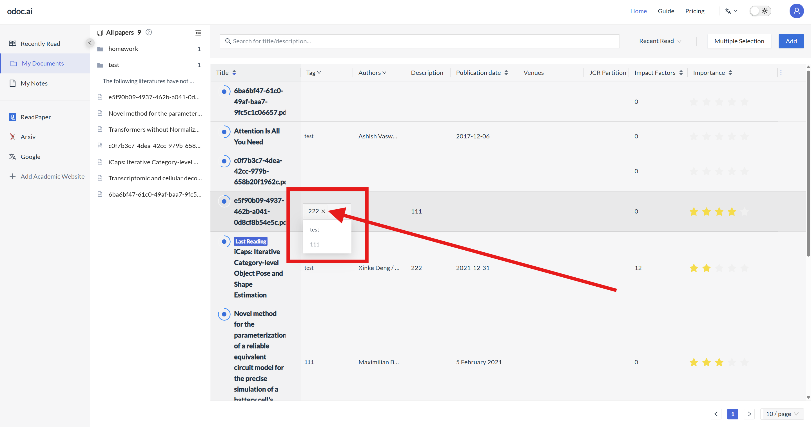
## 3.10 Document Notes
On the page for modifying bibliographic information, click the notes button and enter note information. The note information will be synchronously displayed to the right of the document title;
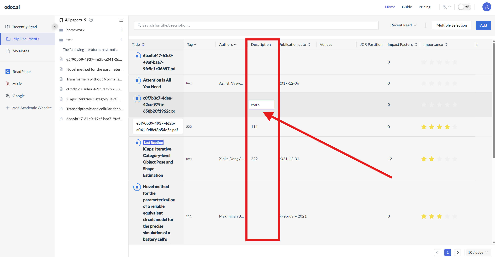
## 3.11 Folder Sorting
Folders on the document list page can be manually dragged to freely sort them or merge them into subfolders.
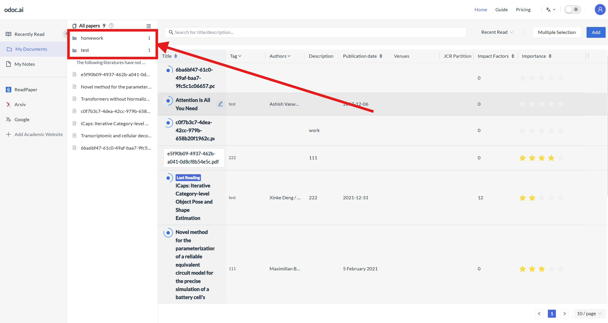
# 3.12 Document Reading History
Click "Recent Reads" in the left sidebar to view document reading history, categorized by reading time into "Today," "Yesterday," "Seven Days Ago," and "Earlier This Month." You can also add documents from this interface.
.png)
.png)