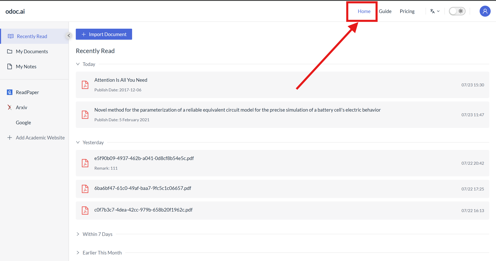
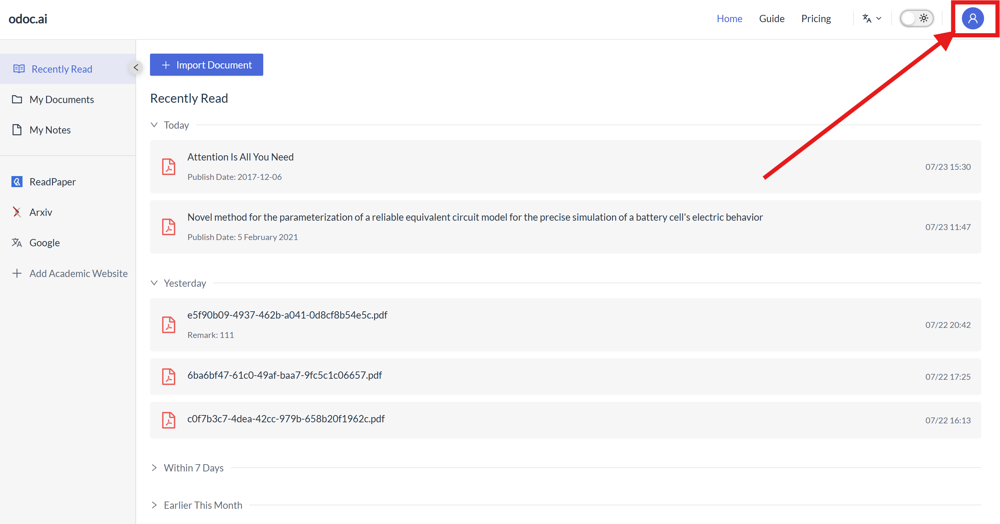
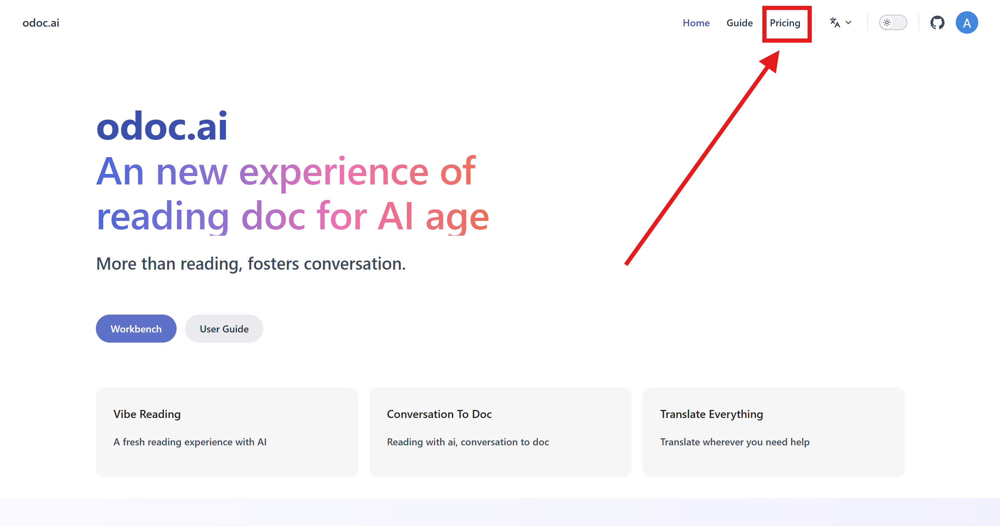
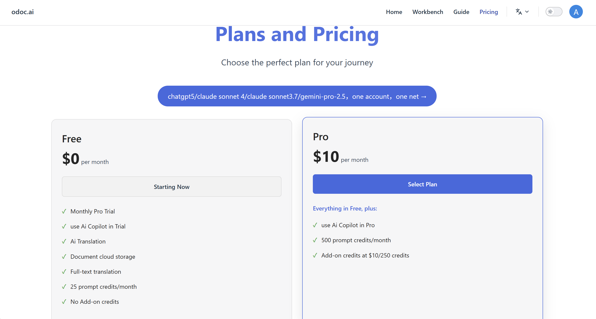
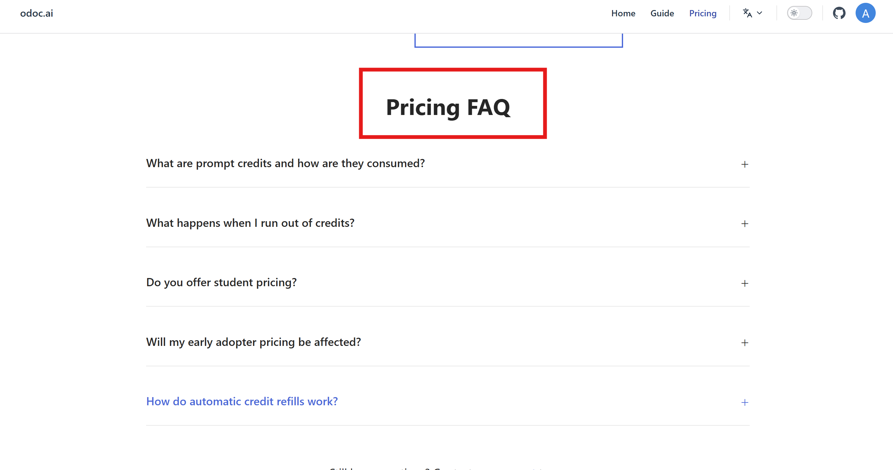

# 2. Homepage Top Toolbar Introduction
## 2.1 Homepage Navigation
Click "Homepage" in the top toolbar from any interface to jump to the homepage, where you can view the workbench, user manual, product highlights, etc.

## 2.2 User Guide
Click "Guide" in the top toolbar to select and view introductions to odoc.ai, user manuals, related agreements, and more in the left sidebar.
.png)
.png)
## 2.3 Page Font: Chinese/English Toggle
Click this icon in the top toolbar to switch the page text between Chinese and English with one click.
.png)
.png)
## 2.4 Page Font Color: Light/Dark Theme Toggle
Click this icon in the top toolbar to switch between black and white themes with one click.
.png)
.png)
## 2.5 Personal Center - (Personal Profile/Settings/Login)

### 2.5.1 Personal Profile
### 2.5.2 Settings
### 2.5.3 Log Out
Click "Personal Profile - Log Out" on the far right of the top toolbar to complete the operation.

## 2.6 Membership Services
Click "Pricing" in the top toolbar to enter the membership activation page.

### 2.6.1 Membership Pricing
Divided into Free and Pro versions based on the number of features. The Pro version is $12/month, offering more comprehensive features and greater convenience. You can choose according to your needs.

### 2.6.2 Membership Features
(1) Below the pricing on the membership page, you can view and compare the feature differences between the Free, Pro, and Enterprise versions in a comparison table.
.png)
(2) Plan Features and Differences Guide
This guide aims to help you understand the core features and main differences of our three plans (Free, Pro, Enterprise) so you can choose the version that best suits your needs.

a. Free Version ($0/month)

• Positioning: Basic entry-level, suitable for light personal use.

• Core Features: (Includes all basic features) AI Assistant, document cloud storage, cloud notes, full-text translation, word translation, AI translation, OCR translation.

• Main Limitations:

Prompt Points: Limited to 25 points per month.

Storage Capacity: Maximum 20MB.

File Size: Maximum 10MB per file.

Document Pages: Maximum 30 pages.

• Point Consumption:

Full-text Translation: 5 points/instance

Word Translation: 1 point/instance

AI Translation: 0.01 points/instance

OCR Translation: 1 point/instance

Additional Points: Cannot purchase additional prompt points.

• Suitable for: Individuals with simple needs and low usage frequency.
.png)

b. Pro Version ($10/month)

• Positioning: Enhanced features, suitable for individuals or small team users requiring higher usage frequency and capacity.

• Core Features: Includes all basic features of the Free version.

• Main Enhancements:

Prompt Points: Provides 500 points per month (significantly increased).

Storage Capacity: Increased to 30960MB (approx. 30GB).

• File Size: Maximum 100MB per file.

• Document Pages: Maximum 100 pages.

• Point Consumption (more efficient):

Full-text Translation: 5 points/instance (same as Free version)

Word Translation: Only 0.1 points/instance (significantly reduced consumption)

AI Translation: 0.25 points/instance

OCR Translation: Only 0.25 points/instance (significantly reduced consumption)

Additional Points: Can purchase additional prompt points, priced at $10 / 250 points.

• Suitable for: Individuals, freelancers, or small teams needing to process more and larger documents, frequent translation needs, or higher point allowances.
.png)

c. Enterprise Version (Custom Pricing)

• Positioning: Large-scale customization, suitable for enterprises or organizations with a large number of users (typically over 200 people).

• Core Features: Includes all basic features of the Free and Pro versions.

• Main Characteristics:

User Scale: Designed for large organizations with over 200 users.

• Features and Limitations: Storage capacity, page limits, file size limits, etc., typically do not pose bottlenecks (shown as "√" in the table, indicating provided and usually without strict limits or customizable).

• Prompt Points: Need to contact us for a custom point plan, usually includes a large allowance.

• Additional Points: Need to contact us for a custom purchase plan.

• Custom Services: May include exclusive support, customized features, security policies, bulk management tools, etc. (specifics require consultation).

• How to Get: Requires contacting us for consultation and custom quotation.

• Suitable for: Large enterprises, educational institutions, government agencies, etc., that require large-scale deployment, advanced features, or customized services.
.png)
### 2.6.3 Membership After-sales
Scroll to the bottom of the membership page to quickly view membership-related questions and solutions.
