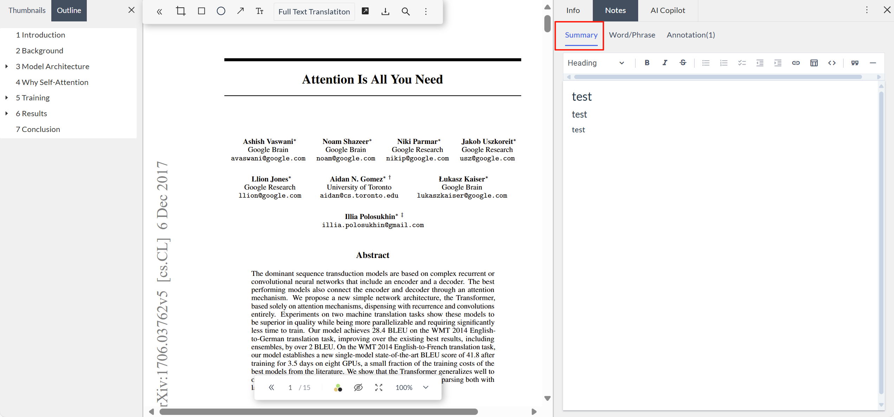
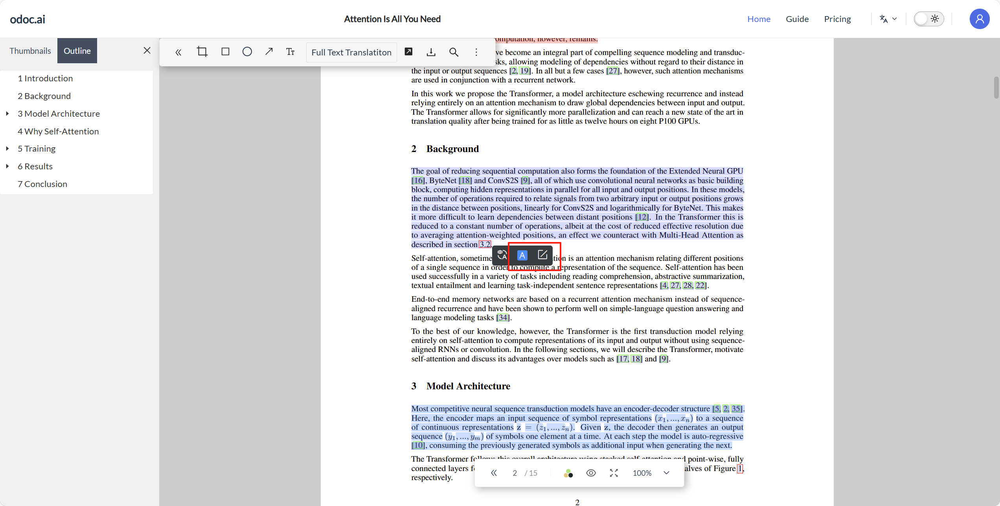
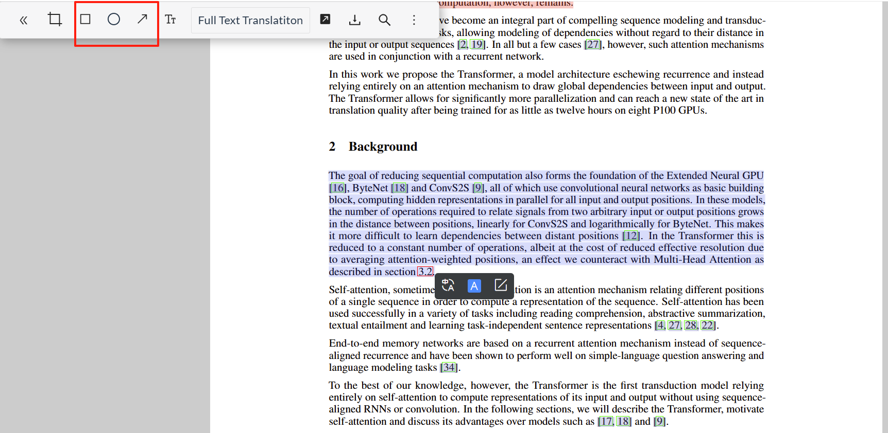
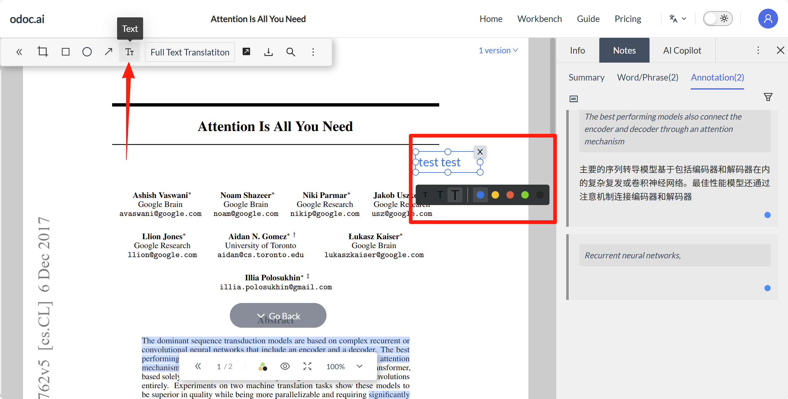
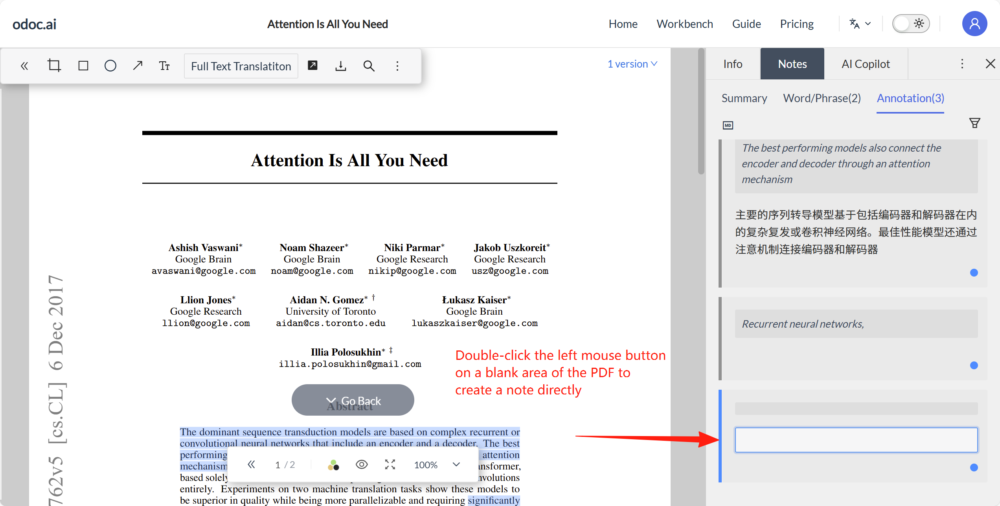
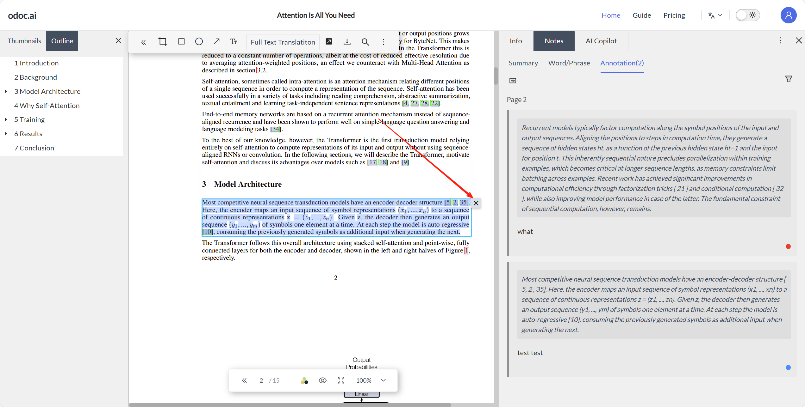

# 7. Note Management
## 7.1 Summary
Right-hand note panel - Summary: Supports long texts and a richer editor with three levels of headings. You can write paper summaries and insights separately in the summary section, making it easy to review and quickly extract core content.

## 7.2 Vocabulary Book
For feature description, see [[4.2]]

## 7.3 Excerpt
- After selecting content in the document with the mouse, click the note button in the toolbar. Both the original text and your notes will be recorded in the right-hand excerpt panel. Floating input for notes is also supported.
.png)
.png)
- Double-click an empty space in the excerpt panel to write a note.
.png)

Note cards within the same page support drag-and-drop to reorder. Supports Markdown format, including formulas, images, and hyperlinks.
Ctrl/Command+C/V to paste images (please wait a few seconds after pasting for the image to upload before saving, otherwise the upload may fail).

## 7.4 Note Tags
Supports tagging excerpt notes for easy categorization and organization. For detailed introduction and operation, see [[4.5]]

## 7.5 Note Tools
### 7.5.1 Highlight
After selecting text with the mouse, click the highlight button or note button in the toolbar, and the text will be covered with a highlight color. Click the highlighted text again to switch colors.

### 7.5.2 Drawing Tools
Drawing tool buttons are located in the top-left toolbar. Currently, there are rectangle, ellipse, and arrow tools, allowing you to highlight key points on the PDF while reading. Click on an existing shape to re-edit it, adjusting its size, position, and color.

### 7.5.3 Text Box
The text box button is in the top-left toolbar. It supports entering text notes anywhere on the PDF, and you can adjust the font size and color as needed. Compared to note cards, PDF text boxes allow you to precisely place notes in the corresponding location, making them clear at a glance. Click on an existing text box to re-edit it, adjusting its size, position, and color.

### 7.5.4 Free Notes
Double-click on an empty space in the PDF to directly create a note, which will be recorded in the right-hand excerpt panel.

### 7.5.5 Delete Notes
Click on the highlight, drawing tool, or text box you wish to delete, and the delete button will appear.
