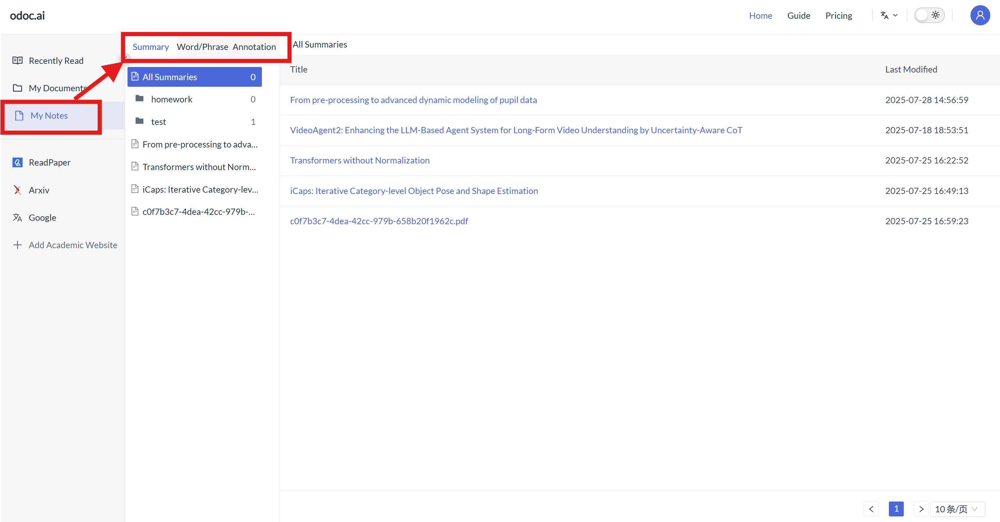
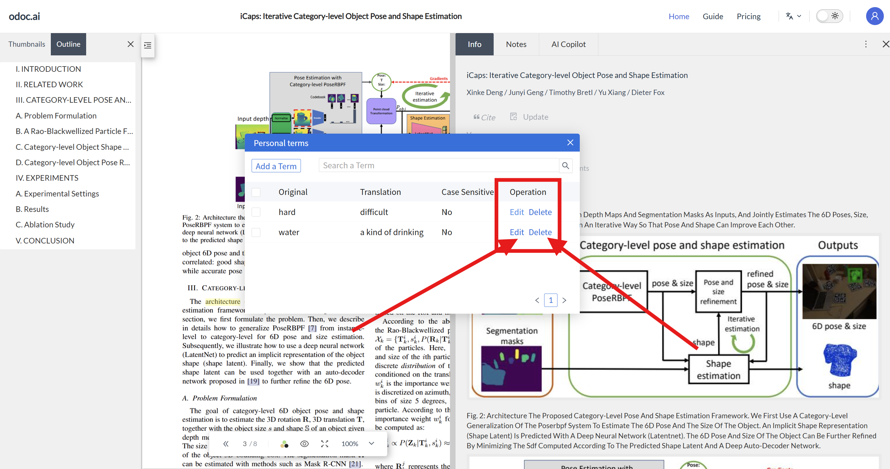
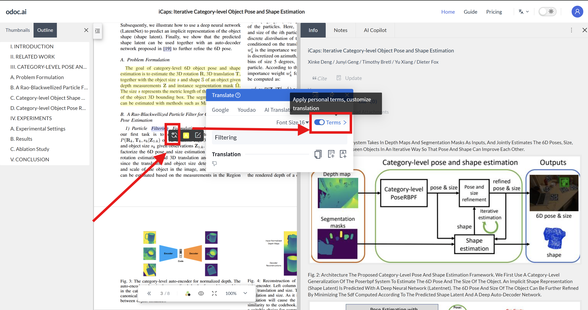

# 4. Note Management
In the [Note List], you can view: [Summary], [Vocabulary Book], [Excerpt Library].
<!--  -->
<!-- 待补充：4.png 图片 -->
## 4.1 Summary
Summaries written while reading documents can be viewed in [My Notes - Summary].

• Click [My Notes - Summary - Document Title] to jump to the summary document of that paper for viewing and editing;
.png)
• All summaries are categorized by the folder where the document is located, and the last edited time can be viewed on the right.
.png)
## 4.2 Vocabulary Book
### 4.2.1 Adding and Viewing Words
• After finding the target word in the document, select it with the left mouse button and click translate. In the word translation interface, you can choose to add it to the "Vocabulary Book".
.png)
.png)
• Above the word translation, you can choose different translation channels to select the most suitable one to add to the vocabulary book.
.png)
• In [My Notes - Words/Phrases], you can view all collected words, parts of speech, definitions, phonetic symbols, and pronunciations;
.png)
• Click [Recitation Mode] in the top right corner of the word page to mask the English and Chinese example sentences of the word, aiding memorization;
.png)
• Click [From Document] on the left side of the word page to view the source document of that word.
### 4.2.2 Modifying and Deleting Definitions
• Click the definition part of the word you want to edit to directly [Edit], then manually input and modify the word definition;
.png)
• Click the [Delete] button in the top right corner of the word you want to delete to remove that word.
.png)
## 4.3 Excerpt Library
### 4.3.1 Definition of Excerpt
In odoc.ai, an excerpt is defined as a sentence or paragraph from a document that has reference value for writing.
Collected excerpts are sentences or paragraphs collected from documents. Self-created excerpts are rewritten sentences or paragraphs from collected excerpts, used for accumulating writing skills.
### 4.3.2 Excerpt Library Operations
Click [Excerpt Library] to view collected excerpts. You can tag excerpts and filter them by tags. Excerpts can also be used for notes, English-to-Chinese translation, deletion, and marking reading progress.
• [Add and View Excerpts]: Select the sentence or paragraph you want to excerpt with the left mouse button, then click translate to add it to [Excerpts];
.png)
.png)
Alternatively, after selecting an excerpt snippet, click edit and add a tag, then save it to excerpts.
.png)
.png)
In addition to text editing, it supports Markdown syntax and Ctrl/Cmd+C/V to paste images.
.png)
• [View Excerpts]: Click [Excerpts] / [Notes - Excerpts] on the right side of the document reading interface to view collected excerpts. Below are two viewing methods:
.png)
.png)
• [Excerpt Tags]: For all added excerpts, you can add tags. Enter content and press Enter to confirm. Or directly select a previous tag name for marking.
.png)
.png)
• [Search Excerpt Content]: All tags will be displayed at the top of the page. Tags are used for easy marking and searching. You can enter keywords for part of the excerpt content and tags you want to find into the search box, then click search to filter out matching excerpts.
.png)
.png)
• [Excerpt Display]: Click [Display Rules] at the top to select based on reading progress;
.png)
Additionally, click the options under "By Latest Excerpt" at the top to display excerpts based on their collection time from different documents or within the same document;
.png)
• [Source Document]: Click the document PDF below the excerpt to view the source document of that excerpt.
.png)
.png)
• [Delete Excerpt]: Click the [Delete] button in the top right corner of an excerpt to delete that excerpt.
.png)
• [Modify Excerpt Tags]: Click an added excerpt in [This Excerpt] or [All Excerpts] to edit the excerpt content in the rewrite box with one click. After clicking confirm, it will be saved in [This Excerpt] and [Notes - Excerpts]. In addition to text editing, it supports Markdown syntax and Ctrl/Cmd+C/V to paste images.
.png)
<!-- .png) -->
<!-- 待补充：4.3.2(18).png 图片 -->
## 4.4 Terminology Database
### 4.4.1 Adding Terms
Select the term you want to add in the document, choose "Terminology Database", and manually add the original word and custom translation. You can customize the translation result.
.png)
.png)
### 4.4.2 Editing or Deleting Terms
Select any word, click translate to enter the terminology database, then select the word. Click "Edit" to modify the translation, or click delete to remove the term.

### 4.4.3 Synchronizing and Viewing Terminology Database
Select any word, click translate to enter the hover-to-translate interface, then enable the terminology database to synchronize term translations. Click "Terminology Database" to view all terms added in that document.

# 4.5 Note Tags
## 4.5.1 [Add Tag]
When reading a document, long-press the left mouse button to select a long sentence, then release the left button. A [Edit Pattern] button will appear below, allowing you to add a tag and save it as an excerpt.
.png)
.png)
## 4.5.2 [Delete Tag]
For all excerpts with added tags, they will be displayed when the mouse hovers over them on the document reading page. Click the icon to delete. Alternatively, on the [Notes - Excerpts] page, click the tag above and delete its content, then press Enter to delete the tag.
.png)
.png)
## 4.5.3 [Rename]
For all excerpts with added tags, you can right-click the tag at the top of the [Notes - Excerpts] page to rename it. Alternatively, when hovering the mouse over the excerpt on the document reading page to display the tag, you can only rename the tag by "deleting the tag first and then re-adding it".
.png)
<!-- .png) -->
<!-- 待补充：4.5.3(2).png 图片 -->