# 8. PDF Reader Features
## 8.1 Top Toolbar Introduction
### 8.1.1 Expand/Collapse Toolbar
Click the [left arrow] button to expand/collapse the toolbar.
.png)
.png)

### 8.1.2 Screenshot
Screenshot of the paper, supporting AI questioning, OCR translation, and saving to notes after taking the screenshot. Shortcut: Alt+R
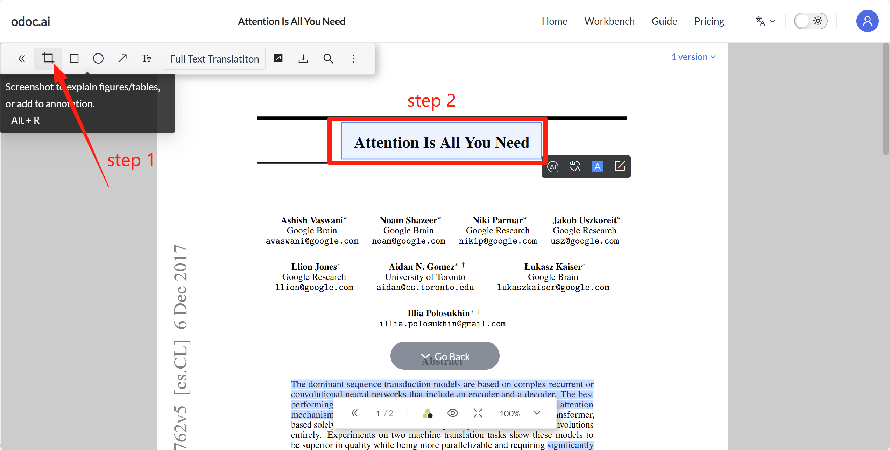

### 8.1.3 Rectangle Tool
Click the [Rectangle] button to select and mark key content in the document. The rectangle marker color can be customized. Click "X" to delete the shape.
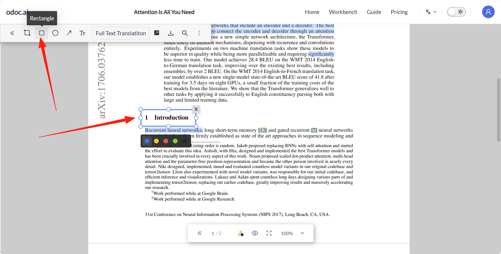

### 8.1.4 Circle Tool
Click the [Circle] button to select and mark key content in the document. The circle marker color can be customized. Click "X" to delete the shape.
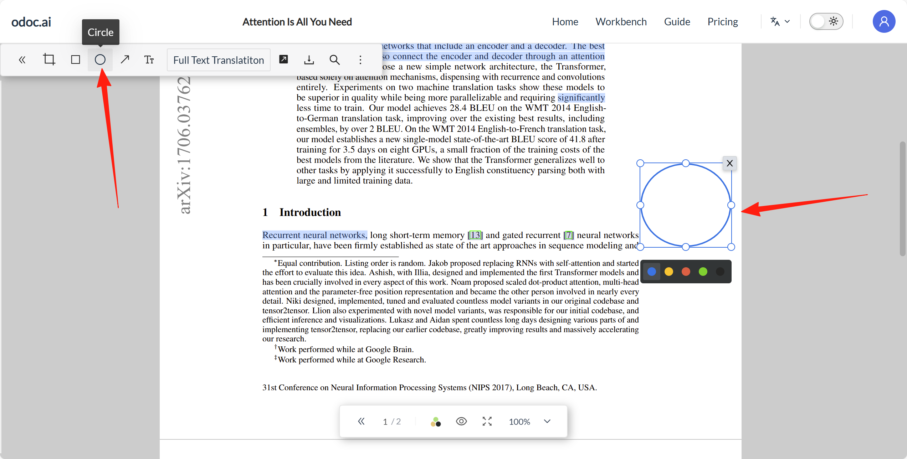

### 8.1.5 Arrow Tool
Click the [Arrow Tool] button to select and mark key content in the document. The arrow marker color can be customized. Click "X" to delete the arrow.
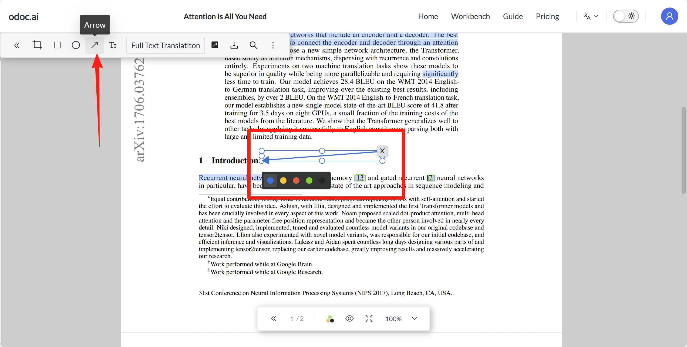

### 8.1.6 Text Box
Supports entering text notes anywhere on the PDF, with customizable font size and color. Compared to excerpt note cards, PDF text boxes allow you to precisely place notes in the corresponding location, making them clear at a glance.
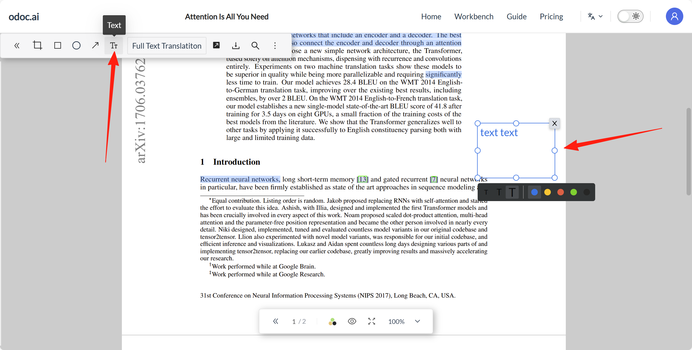

### 8.1.7 Full-text Translation
Supports translating English documents into Chinese documents. The translated text and original text can be viewed separately or side-by-side, which helps improve reading efficiency. Members can permanently retain the translated text. For specific operations, see [[6.5]]

### 8.1.8 Share
Supports sharing the document link with others.
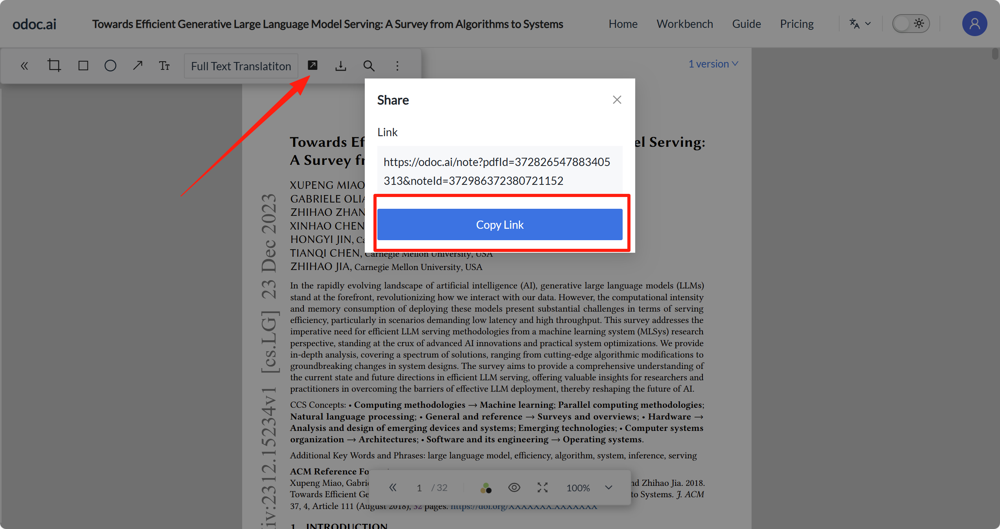

### 8.1.9 Download
Click the [Download] button to export the original PDF and notes.
- Download PDF: Downloads the original PDF file (without additional annotations or notes).
.png)

- Download Notes: Downloads only the notes content of the document (supports PDF and Markdown formats).
.png)

### 8.1.10 Full-text Search
Click the [Full-text Search] button, enter keywords to quickly highlight and jump to all matching locations in the document. Supports shortcut key (Ctrl + F) to enable full-text search mode.
<!--  -->
<!-- 待补充：8.1.10.png 图片 -->

### 8.1.11 More Features
<!-- .png) -->
<!-- 待补充：8.1.11(1).png 图片 -->
- Shortcuts: View and learn all keyboard shortcuts for the reader.
<!-- .png) -->
<!-- 待补充：8.1.11(2).png 图片 -->
- User Guide: Get tips for efficient use of the reader.

## 8.2 Bottom Toolbar Introduction
### 8.2.1 Expand/Collapse Toolbar
Click the [left arrow] button to expand/collapse the toolbar.
.png)
.png)

### 8.2.2 Page Selection
Click [Page Selection] to quickly jump to the corresponding page.
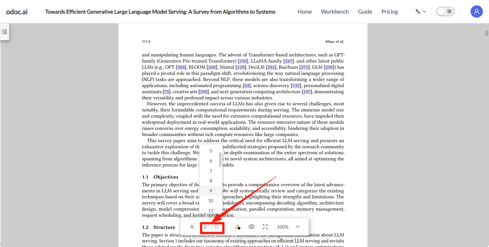

### 8.2.3 Color Mode
The reading page supports switching between multiple theme colors, with one-click switching between "Native, Dark, Beige, Green" reading interface color schemes to adapt to different lighting environments and reading preferences.
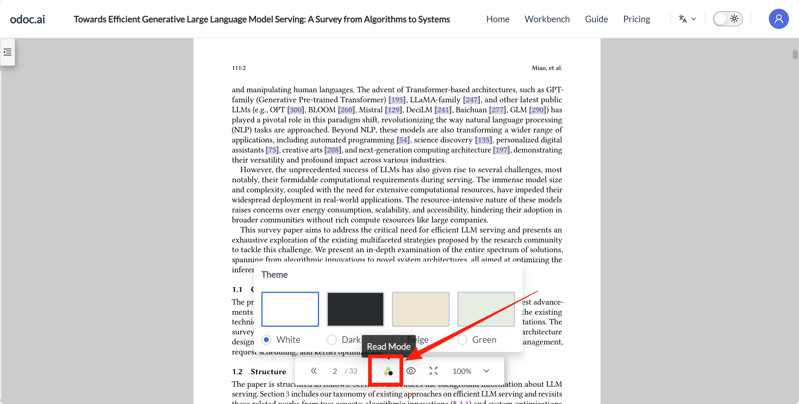

### 8.2.4 Markings
- Others' Markings: When enabled, the document will show where other users have made markings in the same document. When disabled, they are not displayed. If no users have made notes in the same document, this button cannot be enabled.
.png)
- My Markings: When enabled, all your notes and highlights will be displayed. When disabled, all notes and highlights are hidden.
.png)
.png)

### 8.2.5 Full Screen Mode
Enabling full screen mode hides all interface elements, expanding the reading area to the entire screen for an uninterrupted, immersive reading experience. Supports shortcut key (F11) to enable full-screen search mode. Press Esc to exit full screen mode.
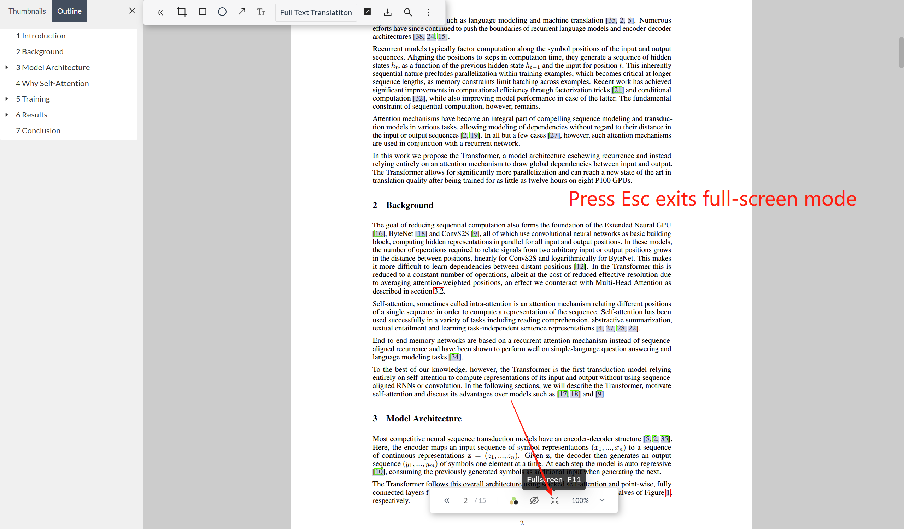
### 8.2.6 Page Zoom
Click [Page Zoom]: Quickly select or directly input a zoom ratio between 50%–400% (e.g., 134%), or one-click "Adaptive" to automatically match the page to the screen width.
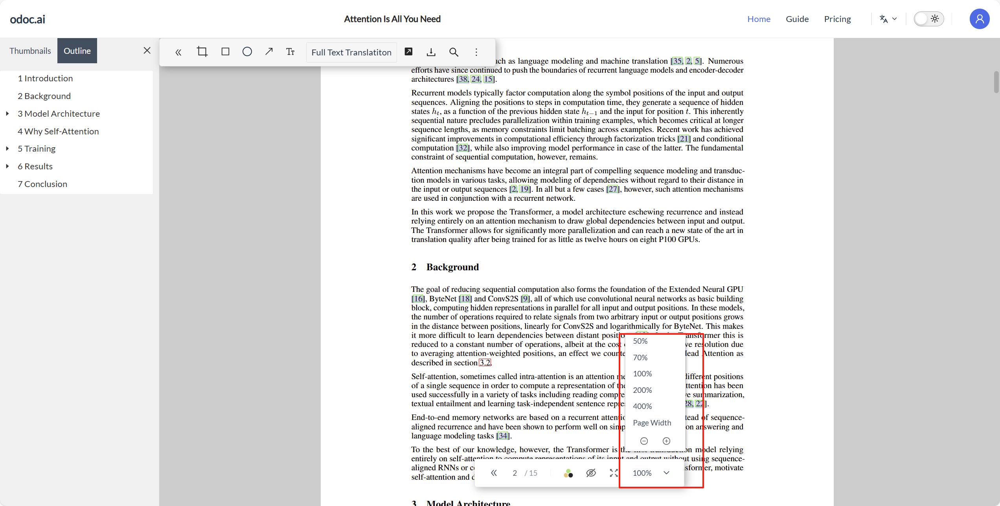

## 8.3 Left Sidebar
The left sidebar is the table of contents, displaying document chapters. Supports shortcut key Alt+Q to quickly expand/collapse the left sidebar.
- Preview: In this mode, thumbnails of each page are displayed. Clicking a thumbnail allows you to quickly jump to the corresponding page.
.png)
- Directory: In this mode, all chapter titles of the document are displayed. Clicking any title allows you to quickly jump to the corresponding chapter.
.png)
Click X to close the directory sidebar.

## 8.4 Right Sidebar
The right sidebar includes Data, Notes, and AI Assistant. Supports shortcut key Alt+W to quickly expand/collapse the right sidebar.
### 8.4.1 Data
The Data sidebar is the document information panel, where you can view document metadata, cited references, and all figures and tables within the document.
- [References]: Instantly view all references cited in the document with one click.
.png)
- [Figures and Tables]: Extracts all figures and tables from the text, supporting one-click jump to the page where they are located. Also supports browsing figures and tables in a small window, which can be pinned to the page.
.png)
.png)
- [Citation]: Supports exporting the citation for this document.
.png)
.png)
- [Update]: Click this button to manually supplement the document's metadata. Also supports English/Chinese search; enter the title or DOI to retrieve document information and complete it with one click.
.png)
.png)

### 8.4.2 Notes
The Notes sidebar includes Summary, Words/Phrases, and Excerpts.
#### 8.4.2.1 Summary
Supports long texts and a richer editor with three levels of headings. You can write paper summaries and insights separately in the summary section, making it easy to review and quickly extract core content.
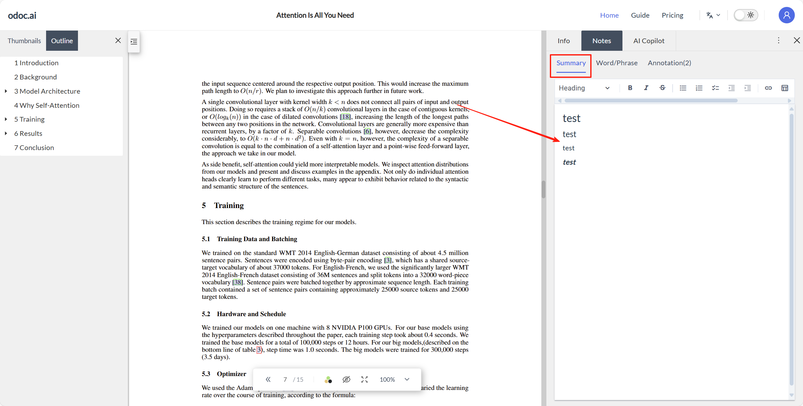
#### 8.4.2.2 Words/Phrases
For Vocabulary Book feature description, see [[4.2]]
- Supports manually adding words/phrases.
.png)
.png)
- Single Highlight: Highlights only the currently selected word/phrase.
.png)
- Highlight All: Highlights all matching words/phrases in the document.
.png)
- No Highlight: Cancels all word/phrase highlights.
.png)
- Can choose to display only words/phrases of a specific color.
.png)
#### 8.4.2.3 Excerpt
For feature description, see [[7.4]]
- Supports Markdown syntax.
.png)
.png)
- Supports Ctrl/Cmd+C/V to paste images.
.png)
.png)
- Note cards within the same page support drag-and-drop to adjust card order.
.png)
- Supports selecting the note color to display.
.png)

# 8.4.3 Return to Previous Position
Click "Return to Previous Position" to instantly jump back to your last reading spot, ensuring seamless reading progress.
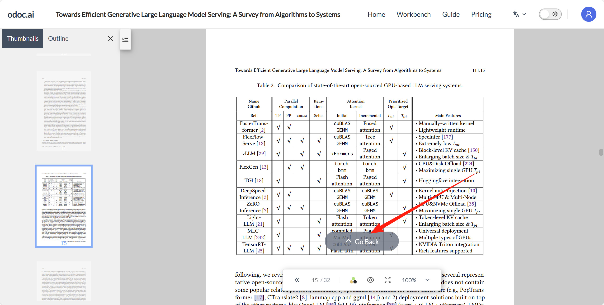