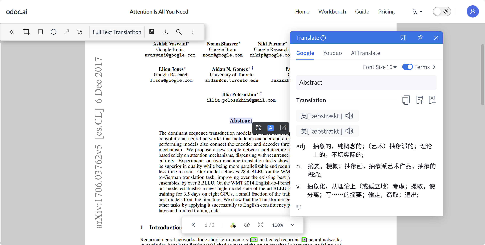
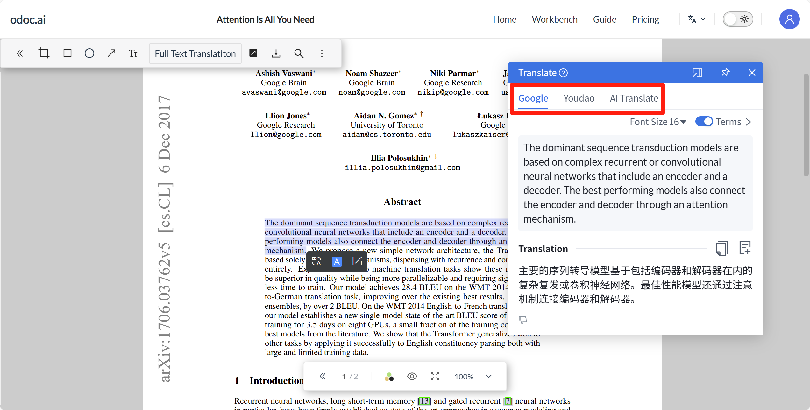
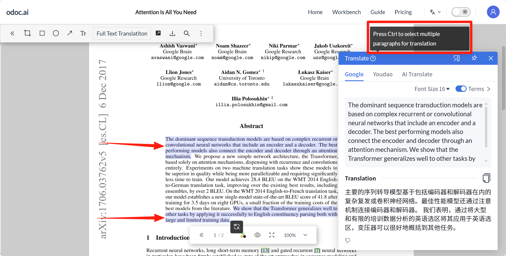
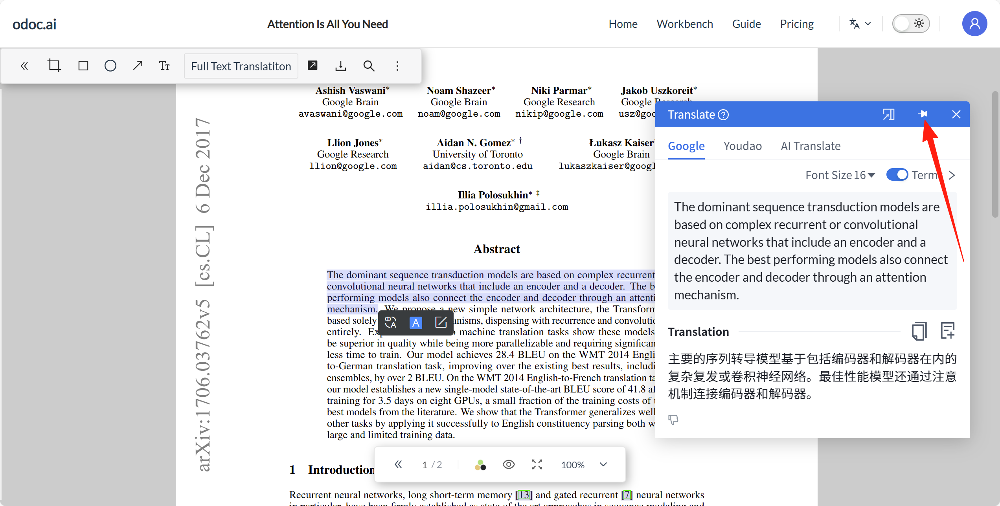
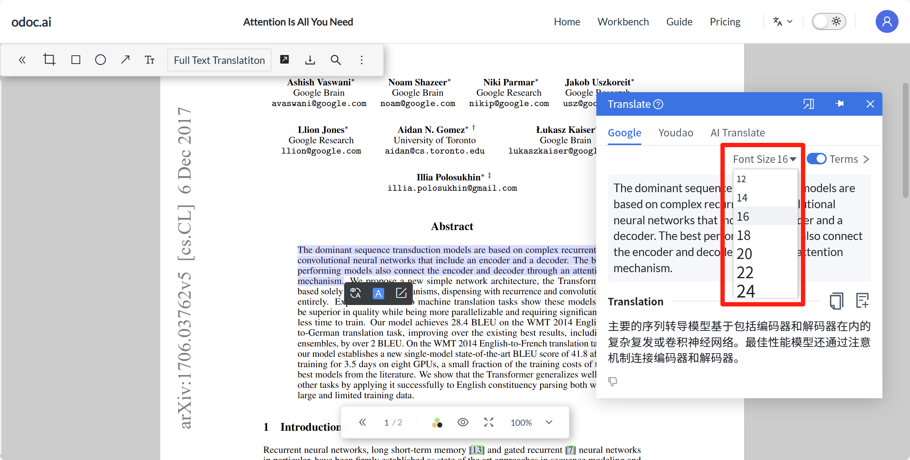
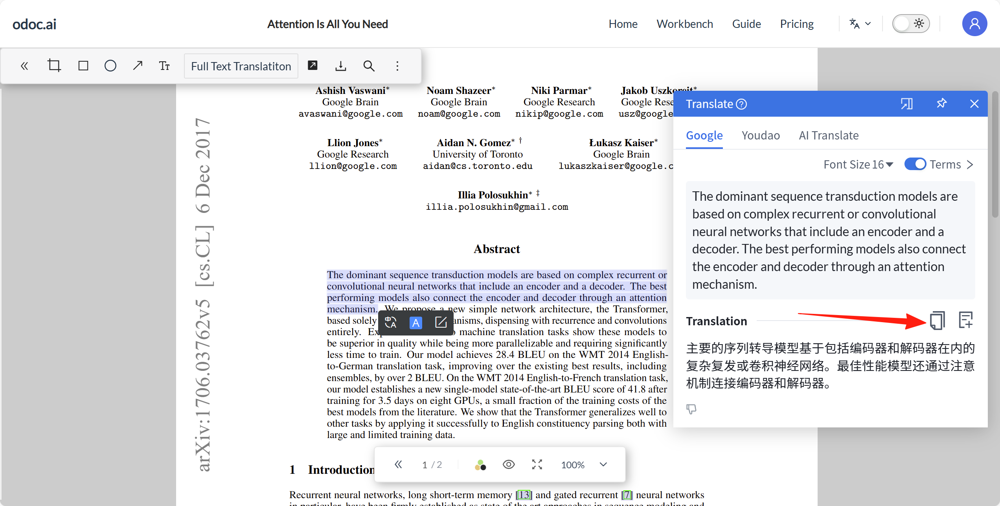
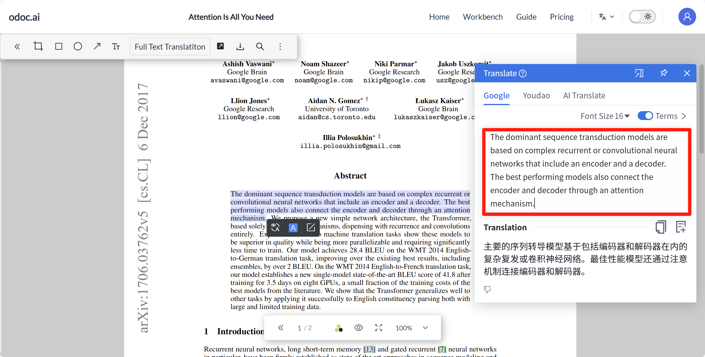
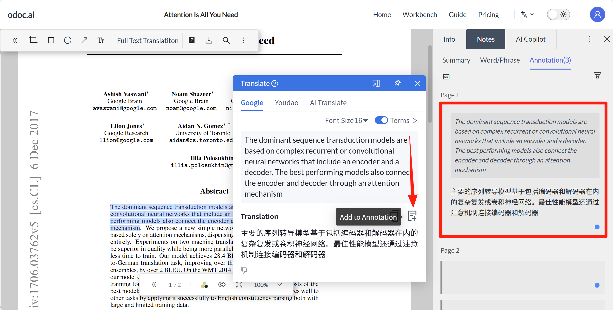
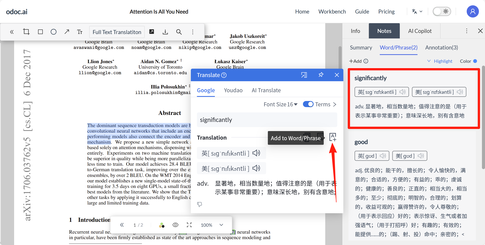
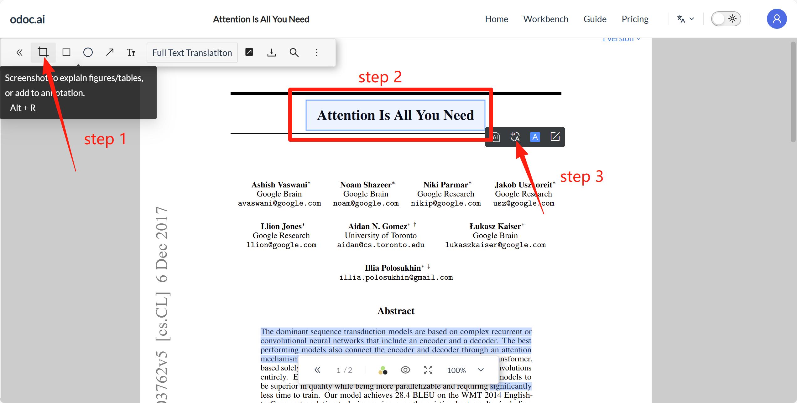

# 6. 翻译功能
## 6.1 划词翻译
### 6.1.1 段落翻译
在文献阅读页面，鼠标左键在文献中划词后会出现工具框，点击翻译按钮。
.png)
.png)
### 6.1.2 单词翻译
双击鼠标或左键划取单词后点击翻译按钮，可展示释义、音标、发音与词性。

单词本功能见[[4.2]]

## 6.2 翻译引擎
翻译框内可切换3种翻译引擎：Google、有道、AI翻译。

- Google翻译：以神经网络技术提升翻译质量，依托海量语料库和先进AI技术，兼具高准确率，专业术语也能读得顺畅如母语。使用Google翻译会消耗积分
- 有道翻译：以亿级学术词库以及自研AI技术带来精准译文。使用有道翻译会消耗积分
- AI翻译：具有强大的语言理解和生成能力，它能够准确理解输入文本并生成自然流畅的翻译。使用AI翻译会消耗积分

## 6.3 跨段、跨栏、跨页翻译
按住Ctrl/Cmd可选中不同段落、不同页面的文本，点击翻译按钮，可将其自动拼接跨页，整句逻辑完整呈现，无需手动翻页、复制粘贴。

## 6.4 翻译框功能介绍
### 6.4.1 锁定到右侧栏
点击此按钮可将翻译框固定在右侧栏内，释放正文视野，零遮挡沉浸阅读，并且划词即刻呈现译文，无需重复点击翻译按钮。
.png)
.png)

弹出翻译框，即可恢复悬浮翻译框。
.png)

### 6.4.2 固定翻译框
启用“钉住”功能后，翻译框将常驻页面，划词即刻呈现译文，无需重复点击翻译按钮。

### 6.4.3 字号
一键调节翻译框内文字大小，适配阅读距离与视力需求。

### 6.4.4. 术语库
个人术语库，可自定义翻译结果。阅读文献时，系统会优先调用自建或导入的术语库进行匹配。当原文出现已收录的专业词汇、缩写或机构名时，译文将自动替换为库内指定译法，确保关键概念始终统一；若默认翻译结果与你的学科习惯不符，可随时在侧栏一键修改并实时生效，后续所有文档同步应用，无需反复校正。
术语库内，支持搜索术语，并且支持多选术语进行删除操作。编辑术语时，支持选择是否区分大小写，以及是否翻译该术语。
.png)
.png)
.png)

### 6.4.5 译文一键复制
点击【一键复制】按钮，即可实现译文一键复制。

### 6.4.6 原文修改
有时因为pdf文档问题，在划词时出现选取错误、内容错乱等情况，此时可以在翻译框的原文位置直接点击进行修改。

### 6.4.7 添加到摘录
一键将当前译文连同原文片段存入摘录内，自动生成双语对照笔记。

### 6.4.8 添加到单词/短语
一键把当前生词或短语（含原文、译文、音标、发音、词性、释义）收录进单词本，自动生成可复习的双语卡片

## 6.5 全文翻译
支持将英文文档翻译成中文文档，译文与原文可以以译文分离、左右对照的形式查看，便于提高阅读效率。会员可永久保留译文。使用全文翻译会消耗积分。
### 6.5.1 全文翻译操作
文献阅读页，点击上方工具栏内的【全文翻译】按钮，后点击【开始翻译】按钮，待翻译进度更新至100%后，再次点击【全文翻译】按钮即可实现中英对照阅读。
.png)
.png)
### 6.5.2 全文翻译查看
鼠标悬浮在【全文翻译】按钮上可做下列操作：
- 双边锁定滚动：开启时，同时锁定原文和译文区域的滚动条，确保在阅读时，两侧内容始终保持同步联动，中英段落精准对齐，对照阅读提高阅读效率。关闭时，两侧可独立滑动。便于单独查阅原文或译文的某一段落，而不受另一侧位置限制。
.png)
.png)
- 显示原文：开启时，中英双栏对照阅读。关闭时，可隐藏原文，沉浸式阅读，抛开对照干扰。
.png)
.png)
### 6.5.3 全文翻译导出
将当前显示的译文内容生成PDF文件，方便保存、打印或分享翻译后的文档。
.png)
.png)

## 6.6 OCR翻译
针对部分PDF（如影印、扫描件上传）无法被识别进行划词翻译的问题，可通过截取图片或文字进行OCR翻译。使用OCR翻译会消耗积分
点击左上角工具栏内的截图按钮，截取需翻译的内容后，再点击翻译按钮既可实现OCR翻译。
